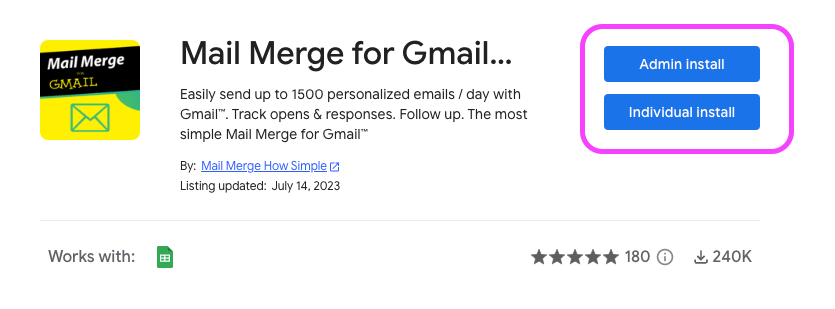

# Installation

On this page, you will find the 2 steps to install Mail Merge for Gmail Tools and how to access it.

There is a quick video if you don't have the time to read the documentation.

You will also find troubleshooting information about known issues that could happen.

### Install Mail Merge for Gmail 

Install Mail Merge for Gmail from the [Google Workspace marketplace](https://workspace.google.com/marketplace/app/mail\_merge\_for\_gmail\_how/57033717989) if you haven’t already done so by clicking on the “Install” button.

<figure><figcaption>
Mail Merge for Gmail How Simple on Google Workspace Marketplace
</figcaption></figure>

* A pop-up will ask for your authorization to install the add-on, click on Continue
* Another popup will ask you for some permissions, click on "Allow"

After the installation (it usually takes less than 15 seconds) you will get a popup, saying that the add-on has been installed.

The next step is to open the add-on and let the magic happen.

### Launch Mail Merge for Gmail 

<figure><figcaption>
Launch Mail Merge for Gmail Add-on from Google Sheets
</figcaption></figure>

* Open Google Sheets (if Google Sheets was already opened, refresh the page)
* Add-ons take around 15s to load after you opened Google Sheets.
* Go to Extensions / Mail Merge For Gmail / Start ... there you go!

### Installation issues: 

There are two known issues that we can't fix, as it doesn't depend on Mail Merge for Gmail:

**1- The add-on doesn't seem to be installed successfully / I never get the "add-on installed successfully" popup:**

This issue can occur when you sign in to Google accounts, and you are not using the principal account for installation. An easy workaround is to open a private window, sign in to the Google account you want, and then proceed to the installation.

**2- After successful installation, Merge for Gmail is not visible in Google Sheets:**

Simply refresh Google Sheets, wait for 10 seconds, and it should appear in the menu!
